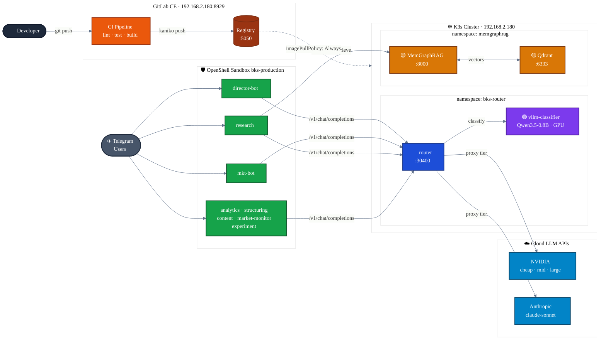
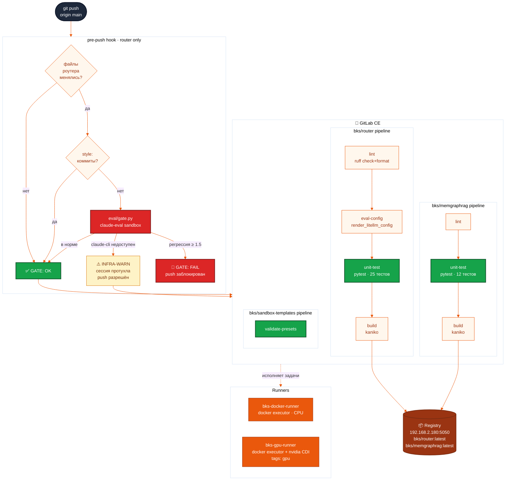
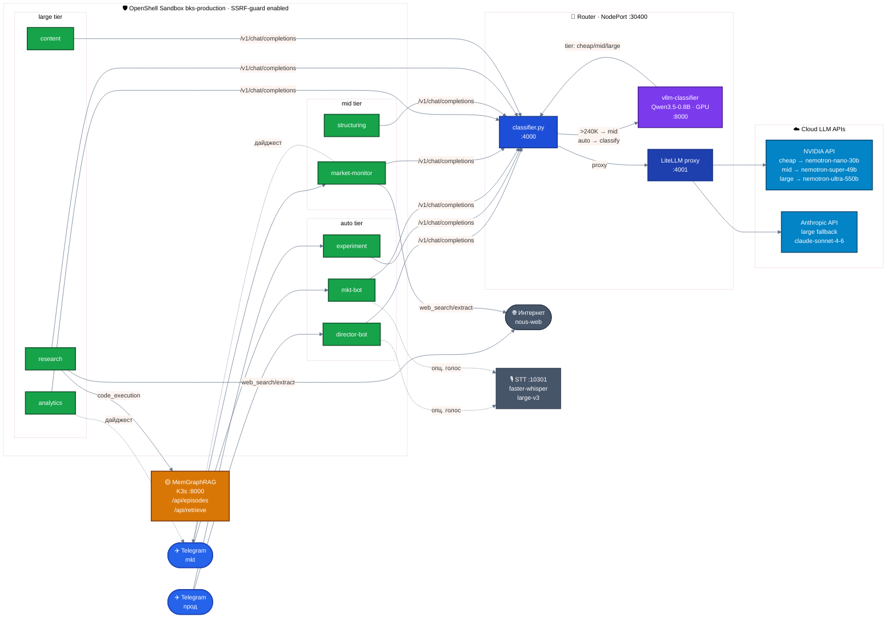
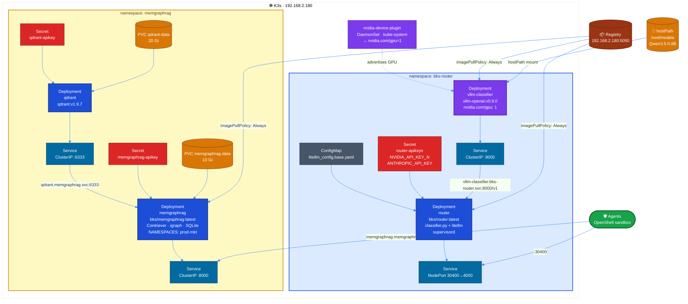
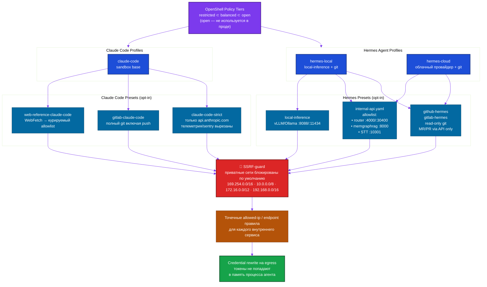
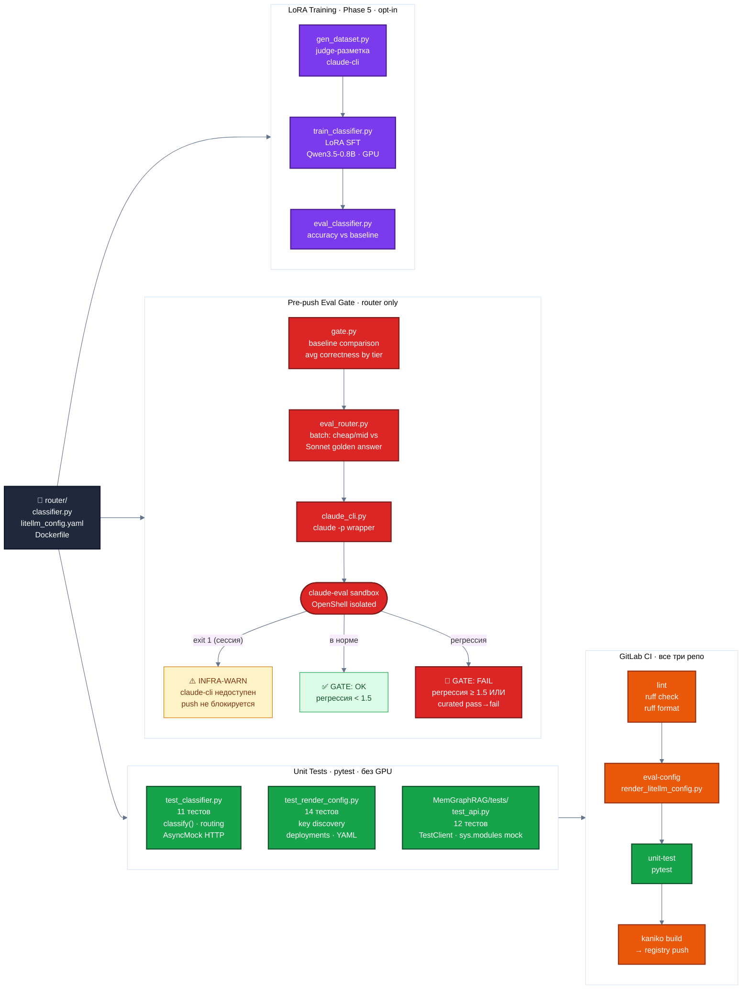

# nemohermes_bks — Architecture Diagrams

Рендерится нативно в GitLab / GitHub. Для редактирования: [mermaid.live](https://mermaid.live)

**Цветовой код (единый для всех диаграмм):**
🟢 Агенты &nbsp;|&nbsp; 🔵 Роутер / K3s &nbsp;|&nbsp; 🟣 GPU / vLLM &nbsp;|&nbsp; 🟠 GitLab CI &nbsp;|&nbsp; 🩵 Облачные API &nbsp;|&nbsp; 🟡 Хранилище &nbsp;|&nbsp; 🔴 Security / Gate

---

## 1 · Обзор системы

---

## 2 · CI/CD Pipeline

---

## 3 · Agent Runtime

---

## 4 · K3s Infrastructure

---

## 5 · Security Layers

---

## 6 · Quality Gates & Testing

