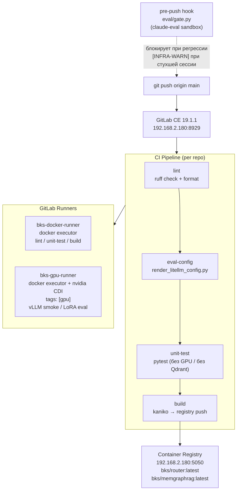
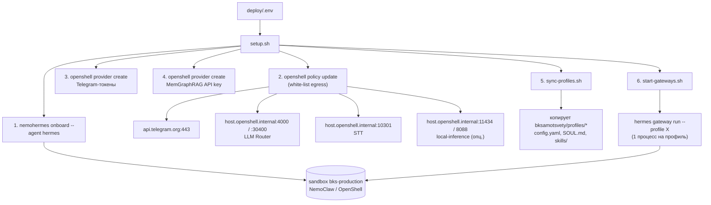
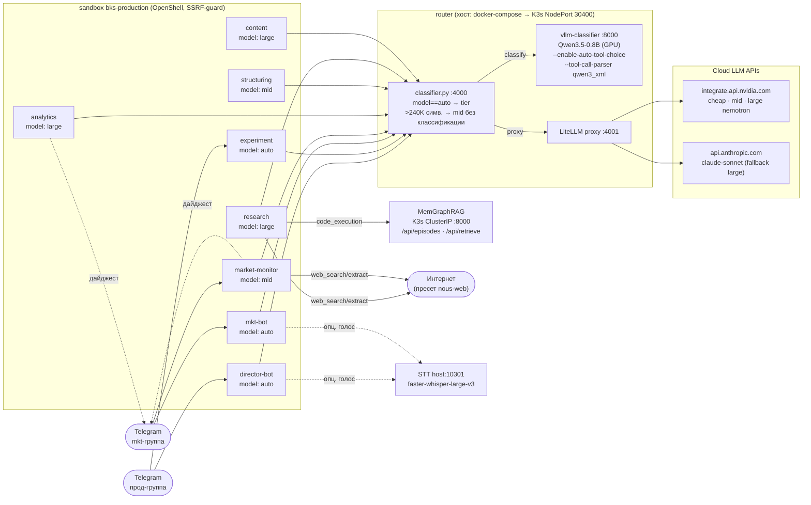
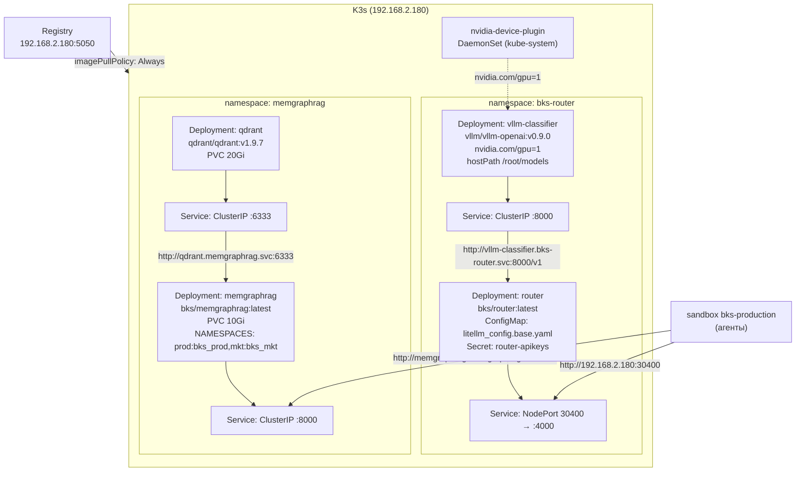
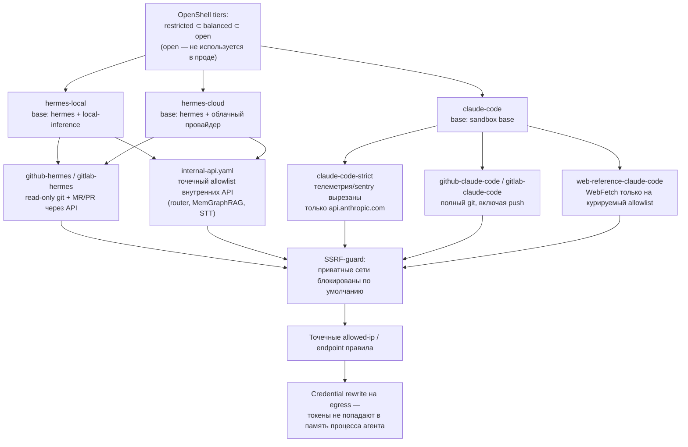
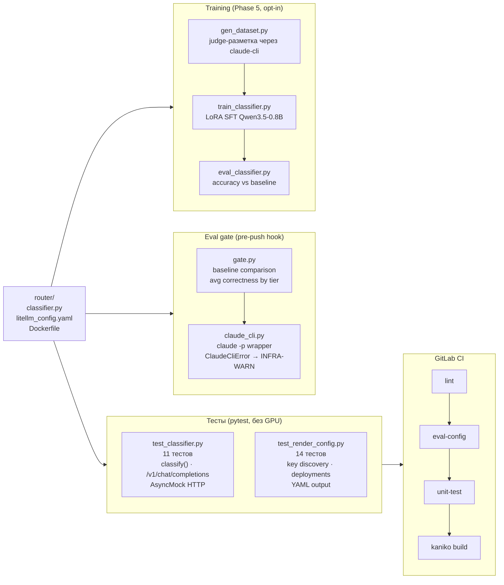

# nemohermes_bks — схема взаимодействия (Mermaid)

Та же схема, что в [ARCHITECTURE.md](./ARCHITECTURE.md), но в формате
блок-диаграмм Mermaid. Рендерится нативно на GitHub/GitLab, либо через
[mermaid.live](https://mermaid.live) / VS Code-плагин Markdown Preview Mermaid.

---

## 0. CI/CD инфраструктура (GitLab CE)

---

## 1. Контур деплоя (хост → sandbox)

---

## 2. Рантайм: 8 профилей, роутер, внешние сервисы

---

## 2.5 K3s: целевой деплой сервисов

> Статус 2026-06-28: манифесты готовы, K3s ещё не установлен.
> Установка: `sudo bash /home/admin/servers/k3s/install.sh`

---

## 3. Слой безопасности (OpenShell / NemoClaw / sandbox-templates)

---

## 4. Качество и CI роутера

