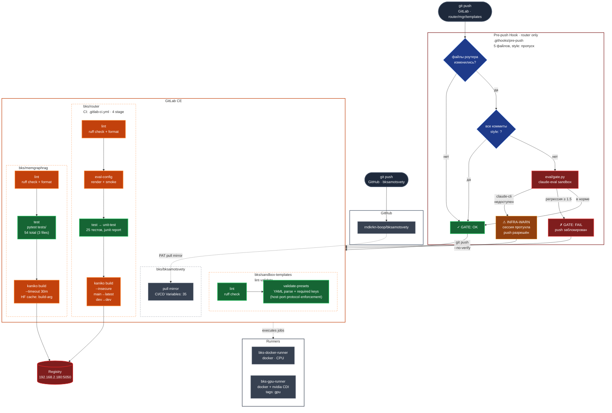
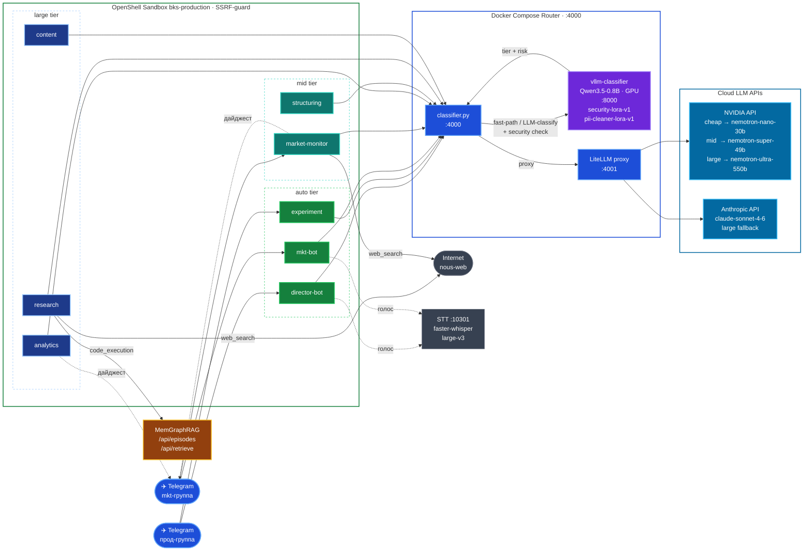
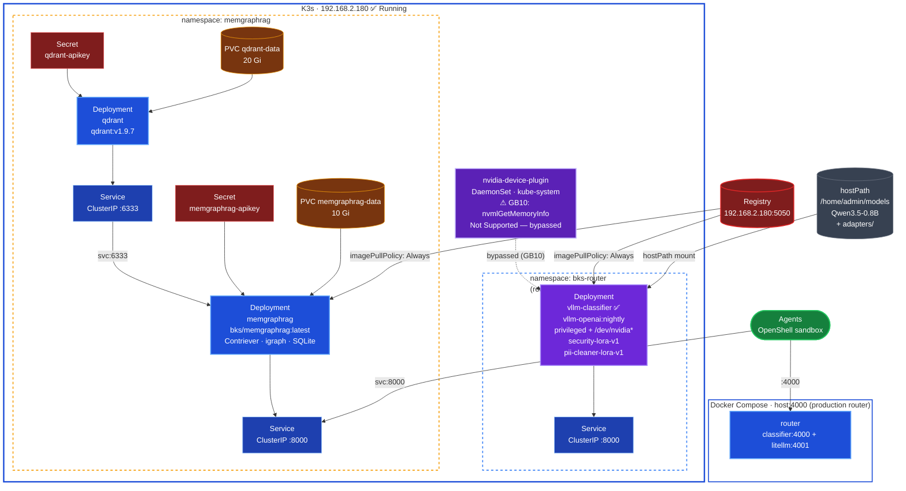
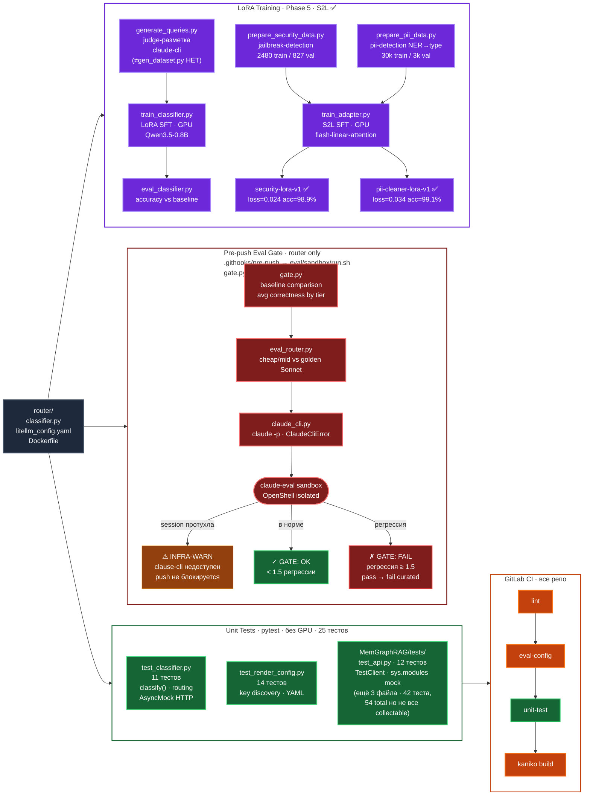

# nemohermes_bks — Architecture Diagrams

Рендерится нативно в GitLab / GitHub · [mermaid.live](https://mermaid.live) для редактирования

**Цветовой код (единый для всех диаграмм):**

| Цвет | Компонент |
|---|---|
| 🟤 Тёмно-серый | Developer / внешние участники |
| 🟠 Оранжевый | GitLab CI / Pipeline stages |
| 🟢 Зелёный | Агенты Hermes |
| 🔵 Синий | Роутер / K3s Deployments / Services |
| 🟣 Фиолетовый | GPU / vLLM / Security |
| 🩵 Голубой | Cloud LLM APIs |
| 🟡 Янтарный | Хранилище (PVC, Storage, Secret) |
| 🔴 Красный | Gate / Блокировка / Registry |

---

## 1 · System Overview

```mermaid
flowchart LR
    classDef dev      fill:#1e293b,stroke:#475569,color:#f8fafc,stroke-width:2px
    classDef ci       fill:#c2410c,stroke:#ea580c,color:#fff,stroke-width:2px
    classDef registry fill:#7f1d1d,stroke:#dc2626,color:#fff,stroke-width:2px
    classDef agent    fill:#15803d,stroke:#22c55e,color:#fff,stroke-width:2px
    classDef router   fill:#1d4ed8,stroke:#60a5fa,color:#fff,stroke-width:2px
    classDef vllm     fill:#6d28d9,stroke:#a78bfa,color:#fff,stroke-width:2px
    classDef cloud    fill:#0369a1,stroke:#38bdf8,color:#fff,stroke-width:2px
    classDef memory   fill:#92400e,stroke:#fbbf24,color:#fff,stroke-width:2px
    classDef external fill:#374151,stroke:#6b7280,color:#fff,stroke-width:2px

    DEV(["👨‍💻 Developer"]):::dev
    TG(["✈️ Telegram"]):::external

    subgraph GH["GitHub · rndkrkn-boop"]
        GHBKS["bksamotsvety\nsource-of-truth"]:::dev
    end

    subgraph GITLAB["GitLab CE · :8929"]
        GL["CI Pipeline\nrouter · memgraphrag\nsandbox-templates"]:::ci
        REG[("Registry :5050")]:::registry
        GLBKS["bks/bksamotsvety\npull mirror · CI/CD Vars"]:::ci
        GL -->|kaniko| REG
        GHBKS -.->|"pull mirror\nPAT"| GLBKS
    end

    subgraph SAND["OpenShell Sandbox  bks-production"]
        AG["8 Hermes Agents"]:::agent
    end

    subgraph DC["Docker Compose · host:4000 (production router)"]
        DCR["router\nclassifier:4000 + litellm:4001\nSECURITY_MODEL=security-lora-v1"]:::router
    end

    subgraph GB10["GPU Hardware · GB10 Grace-Blackwell\nvllm-classifier (не K8s)"]
        VLLM["vllm-classifier\nQwen3.5-0.8B · GPU\nsecurity-lora-v1 · pii-cleaner-lora-v1"]:::vllm
    end

    subgraph K3S["K3s Cluster · 192.168.2.180
manifests: router/deploy/ +
MemGraphRAG/deploy/"]
        subgraph NSM["memgraphrag"]
            MGR["MemGraphRAG :8000"]:::memory
        end
    end

    subgraph APIS["Cloud LLM APIs
(openai/nvidia/... · anthropic/...]:::cloud]
        NV["NVIDIA\ncheap · mid · large"]:::cloud
        AC["Anthropic\nlarge fallback"]:::cloud
    end

    DEV -->|"git push\nbksamotsvety"| GHBKS
    DEV -->|"git push\nrouter · mgr · templates"| GL
    REG -.->|pull on restart| K3S

    TG --> AG
    AG -->|/v1/chat/completions| DCR
    DCR -->|"http://vllm-classifier:8000"| VLLM
    DCR -->|proxy| NV & AC
    AG -->|episodes · retrieve| MGR

    style GH     fill:none,stroke:#475569,stroke-width:2px
    style GITLAB  fill:none,stroke:#c2410c,stroke-width:2px
    style SAND    fill:none,stroke:#15803d,stroke-width:2px
    style DC      fill:none,stroke:#1d4ed8,stroke-width:2px
    style GB10    fill:none,stroke:#6d28d9,stroke-width:2px
    style K3S     fill:none,stroke:#374151,stroke-width:2px
    style APIS    fill:none,stroke:#0369a1,stroke-width:2px
```

---

## 2 · CI/CD Pipeline



---

## 3 · Agent Runtime



---

## 4 · K3s Infrastructure



---

## 5 · Security Layers

```mermaid
flowchart TD
    classDef tier    fill:#4c1d95,stroke:#a78bfa,color:#fff,stroke-width:2px
    classDef profile fill:#1e3a8a,stroke:#93c5fd,color:#fff,stroke-width:2px
    classDef preset  fill:#1e40af,stroke:#60a5fa,color:#fff,stroke-width:1px
    classDef guard   fill:#7f1d1d,stroke:#f87171,color:#fff,stroke-width:2px
    classDef rule    fill:#78350f,stroke:#fbbf24,color:#fff,stroke-width:1px
    classDef cred    fill:#166534,stroke:#4ade80,color:#fff,stroke-width:2px
    classDef note    fill:#1e293b,stroke:#94a3b8,color:#fbbf24,stroke-width:1px

    TIERS["OpenShell Policy Tiers\nrestricted ⊂ balanced ⊂ open\n(open — не используется в проде)"]:::tier

    subgraph HERMES["Hermes Profiles"]
        PH1["hermes-local\nlocal inference + git"]:::profile
        PH2["hermes-cloud\nоблачный провайдер + git"]:::profile
    end
    subgraph CCPROF["Claude Code Profile
⚠ claude-code — НЕТ в NemoClaw
tолько openclaw/manifest.yaml +
policy-пресеты из sandbox-templates/"]:::note
        PC1["openclaw sandbox base"]:::profile
    end

    TIERS --> HERMES & CCPROF

    subgraph HPR["Hermes Presets"]
        PR1["github/gitlab-hermes\nread-only git\nMR/PR via API only"]:::preset
        PR2["internal-api.yaml\nrouter :4000\ndocker-compose\nmemgraphrag :8000\nSTT :10301"]:::preset
        PR3["local-inference\n⚠ НЕ в presets/\nапстрим NemoClaw\n(vLLM :8088 / Ollama :11434)"]:::preset
    end
    subgraph CPR["Claude Code Presets"]
        PR4["claude-code-strict\nтолько api.anthropic.com\nтелеметрия / sentry вырезаны"]:::preset
        PR5["gitlab-claude-code\nполный git включая push"]:::preset
        PR6["web-reference-claude-code\nWebFetch → курируемый allowlist"]:::preset
    end

    PH1 & PH2 --> PR1 & PR2
    PH1 --> PR3
    PC1 --> PR4 & PR5 & PR6

    SSRF["SSRF-guard\nприватные сети блокированы по умолчанию\n10.0.0.0/8 · 172.16.0.0/12\n192.168.0.0/16 · 169.254.0.0/16"]:::guard
    EXPL["Точечные allowed-ip / endpoint правила\nдля каждого внутреннего сервиса"]:::rule
    CRED["Credential rewrite на egress\nтокены не видны процессу агента"]:::cred

    PR1 & PR2 & PR3 & PR4 & PR5 & PR6 --> SSRF --> EXPL --> CRED

    style HERMES fill:none,stroke:#3b82f6,stroke-width:2px
    style CCPROF fill:none,stroke:#3b82f6,stroke-width:2px
    style HPR    fill:none,stroke:#1e40af,stroke-width:1px,stroke-dasharray:4
    style CPR    fill:none,stroke:#1e40af,stroke-width:1px,stroke-dasharray:4
```

---

## 6 · Quality Gates & Testing


