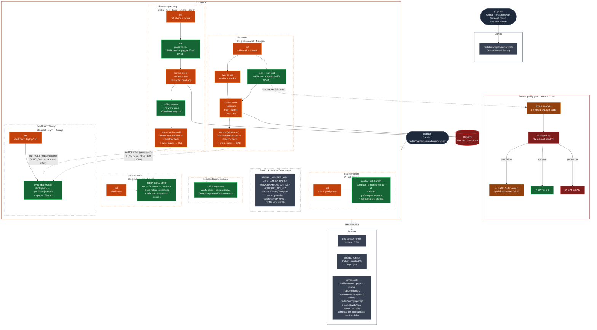
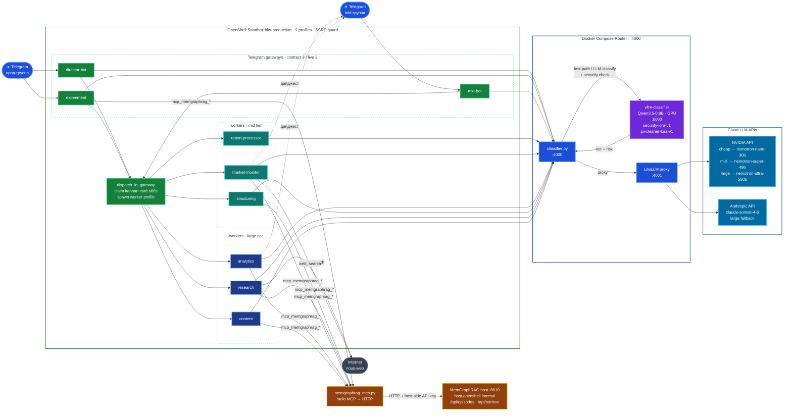
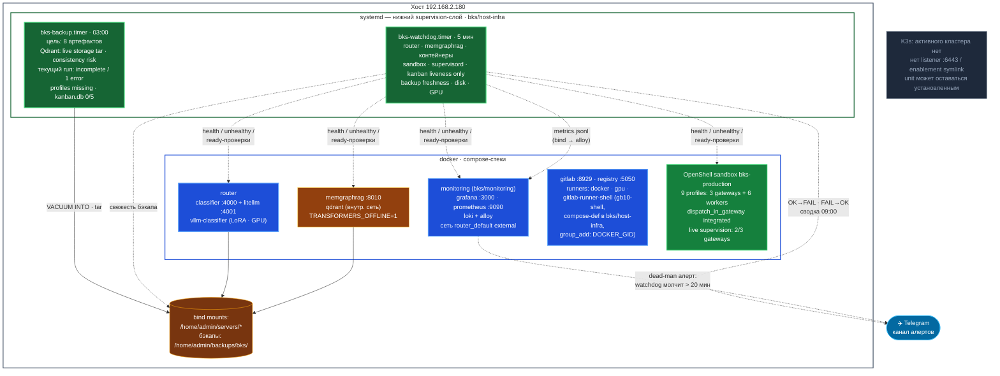
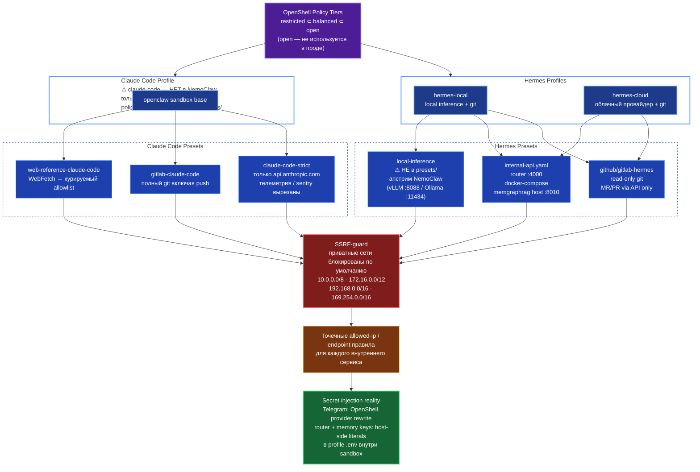
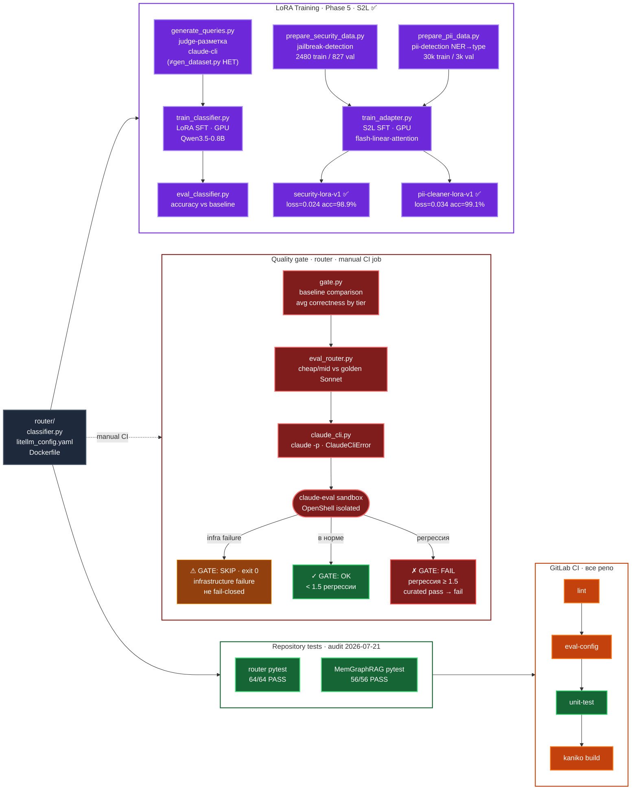
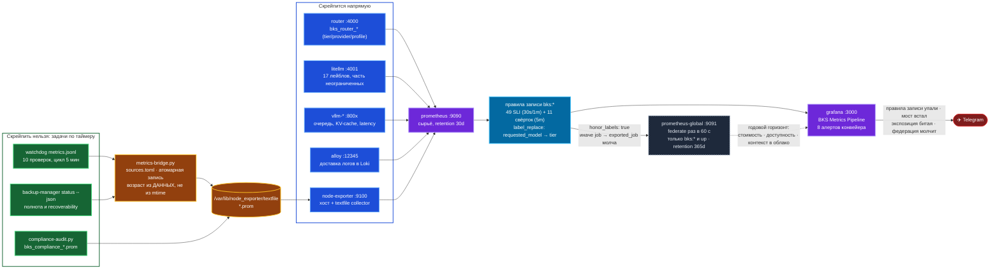

# nemohermes_bks — Architecture Diagrams

Рендерится нативно в GitLab / GitHub · [mermaid.live](https://mermaid.live) для редактирования

> [!CAUTION]
> **NO-GO для безусловной приёмки production (аудит 2026-07-25, повтор
> 2026-07-21).** Бэкап, gateway-контракт (теперь 2/2) и реальный Telegram
> E2E подтверждены живыми доказательствами 2026-07-25. Текущие блокеры —
> сломанная установка `mcp` для MemGraphRAG MCP (read-only
> `/opt/hermes/.venv`) и неподтверждённый GitLab provenance. См.
> [`docs/audit/full-project-audit-2026-07-25.md`](./docs/audit/full-project-audit-2026-07-25.md).

**Цветовой код (единый для всех диаграмм):**

| Цвет | Компонент |
|---|---|
| 🟤 Тёмно-серый | Developer / внешние участники |
| 🟠 Оранжевый | GitLab CI / Pipeline stages |
| 🟢 Зелёный | Агенты Hermes |
| 🔵 Синий | Роутер / docker-compose сервисы |
| 🟣 Фиолетовый | GPU / vLLM / Security |
| 🩵 Голубой | Cloud LLM APIs |
| 🟡 Янтарный | Хранилище (PVC, Storage, Secret) |
| 🔴 Красный | Gate / Блокировка / Registry |

---

## 1 · System Overview

```mermaid
flowchart LR
    classDef dev      fill:#1e293b,stroke:#475569,color:#f8fafc,stroke-width:2px
    classDef ci       fill:#c2410c,stroke:#ea580c,color:#fff,stroke-width:2px
    classDef registry fill:#7f1d1d,stroke:#dc2626,color:#fff,stroke-width:2px
    classDef agent    fill:#15803d,stroke:#22c55e,color:#fff,stroke-width:2px
    classDef router   fill:#1d4ed8,stroke:#60a5fa,color:#fff,stroke-width:2px
    classDef vllm     fill:#6d28d9,stroke:#a78bfa,color:#fff,stroke-width:2px
    classDef cloud    fill:#0369a1,stroke:#38bdf8,color:#fff,stroke-width:2px
    classDef memory   fill:#92400e,stroke:#fbbf24,color:#fff,stroke-width:2px
    classDef external fill:#374151,stroke:#6b7280,color:#fff,stroke-width:2px

    DEV(["👨‍💻 Developer"]):::dev
    TG(["✈️ Telegram"]):::external

    subgraph GH["GitHub · rndkrkn-boop"]
        GHBKS["bksamotsvety\nличный backup"]:::dev
    end

    subgraph GITLAB["GitLab CE · :8929"]
        GL["CI Pipeline\nrouter · memgraphrag\nsandbox-templates · host-infra\nmonitoring"]:::ci
        REG[("Registry :5050")]:::registry
        GLBKS["bks/bksamotsvety\nнезависимый push · CI/CD Vars"]:::ci
        GL -->|kaniko| REG
    end

    subgraph SAND["OpenShell Sandbox  bks-production"]
        GW["3 Telegram gateways по контракту\n2 процесса подтверждены live"]:::agent
        WK["6 worker-профилей\nreport-processor + 5 остальных"]:::agent
        MC["6 MCP-профилей\nexperiment + 5 workers\nбез report-processor"]:::agent
        DISP["dispatch_in_gateway\nkanban claim → worker"]:::agent
        GW --> DISP --> WK
    end

    subgraph DC["Docker Compose · host:4000 (production router)"]
        DCR["router\nclassifier:4000 + litellm:4001\nSECURITY_MODEL=security-lora-v1"]:::router
    end

    subgraph GB10["GPU Hardware · GB10 Grace-Blackwell\nvllm-classifier (не K8s)"]
        VLLM["vllm-classifier\nQwen3.5-0.8B · GPU\nsecurity-lora-v1 · pii-cleaner-lora-v1"]:::vllm
    end

    subgraph MGC["Docker Compose · memgraphrag (K3s декомиссирован 2026-07-06)"]
        MGR["memgraphrag :8010\n+ qdrant · внутр. сеть"]:::memory
    end

    subgraph MON["Docker Compose · monitoring (bks/monitoring)"]
        GRAF["Grafana :3000 · Prometheus :9090\nLoki + Alloy"]:::router
    end

    WD["bks/host-infra · systemd-таймеры\nwatchdog / 5 мин · backup 03:00"]:::external

    subgraph APIS["Cloud LLM APIs
(openai/nvidia/... · anthropic/...)"]
        NV["NVIDIA\ncheap · mid · large"]:::cloud
        AC["Anthropic\nlarge fallback"]:::cloud
    end

    DEV -->|"git push\nbksamotsvety (бэкап)"| GHBKS
    DEV -->|"git push\nrouter · mgr · templates · host-infra"| GL
    DEV -->|"git push\nbksamotsvety"| GLBKS
    REG -.->|"docker compose pull\n(deploy job)"| DCR & MGR

    TG --> GW
    GW & WK -->|/v1/chat/completions| DCR
    DCR -->|"http://vllm-classifier:8000"| VLLM
    DCR -->|proxy| NV & AC
    MC -->|"MCP stdio proxy → HTTP\nhost.openshell.internal:8010"| MGR
    WD -.->|"liveness · unhealthy · disk · gpu"| DCR & MGR & GW
    WD -.->|алерты| TG
    DCR -.->|"metrics · audit-логи"| GRAF
    WD -.->|"metrics.jsonl → Loki"| GRAF
    GRAF -.->|"dead-man:\nwatchdog молчит"| TG

    style GH     fill:none,stroke:#475569,stroke-width:2px
    style GITLAB  fill:none,stroke:#c2410c,stroke-width:2px
    style SAND    fill:none,stroke:#15803d,stroke-width:2px
    style DC      fill:none,stroke:#1d4ed8,stroke-width:2px
    style GB10    fill:none,stroke:#6d28d9,stroke-width:2px
    style MGC     fill:none,stroke:#f59e0b,stroke-width:2px
    style MON     fill:none,stroke:#1d4ed8,stroke-width:2px
    style APIS    fill:none,stroke:#0369a1,stroke-width:2px
```

---

## 2 · CI/CD Pipeline

```mermaid
flowchart TD
    classDef dev    fill:#1e293b,stroke:#475569,color:#f8fafc,stroke-width:2px
    classDef stage  fill:#1e3a8a,stroke:#3b82f6,color:#fff,stroke-width:1px
    classDef ok     fill:#166534,stroke:#22c55e,color:#fff,stroke-width:2px
    classDef warn   fill:#92400e,stroke:#f59e0b,color:#fff,stroke-width:1px
    classDef fail   fill:#7f1d1d,stroke:#ef4444,color:#fff,stroke-width:2px
    classDef ci     fill:#c2410c,stroke:#f97316,color:#fff,stroke-width:2px
    classDef runner fill:#374151,stroke:#9ca3af,color:#fff,stroke-width:1px
    classDef reg    fill:#7f1d1d,stroke:#dc2626,color:#fff,stroke-width:2px

    PUSH(["git push\nGitLab · router/mgr/templates/bksamotsvety"]):::dev
    PUSHGH(["git push\nGitHub · bksamotsvety (личный бэкап,\nбез auto-mirror)"]):::dev

    subgraph QG["Router quality gate · manual CI job"]
        QM["ручной запуск\nне обязательный stage"]:::warn
        QE["eval/gate.py\nclaude-eval sandbox"]:::fail
        QS["⚠ GATE: SKIP · exit 0\nпри infrastructure failure"]:::warn
        QO["✓ GATE: OK"]:::ok
        QF["✗ GATE: FAIL"]:::fail
        QM --> QE
        QE -->|infra failure| QS
        QE -->|в норме| QO
        QE -->|регрессия| QF
    end

    PUSH --> GL

    subgraph GH["GitHub"]
        GHB["rndkrkn-boop/bksamotsvety\n(независимый бэкап)"]:::runner
    end
    PUSHGH --> GHB

    subgraph GL["GitLab CE"]
        subgraph GV["Group bks — CI/CD Variables"]
            GVAR["LITELLM_MASTER_KEY · LITE_LLM_ENDPOINT\nMEMGRAPHRAG_API_KEY · QDRANT_API_KEY\nsource-of-truth; Telegram через provider,\nrouter/memory keys → profile .env literals"]:::runner
        end

        subgraph PR["bks/router
CI: .gitlab-ci.yml · 4 stages"]
            R1["lint
ruff check + format"]:::ci
            R2["eval-config
render + smoke"]:::ci
            R3["test → unit-test
64/64 теста (аудит 2026-07-21)"]:::ok
            R4["kaniko build
--insecure
main→latest
dev→dev"]:::ci
            R5["deploy (gb10-shell)
docker compose up -d
+ health-check
+ sync-trigger → BK2"]:::ci
            R1 --> R2 & R3
            R2 & R3 --> R4 --> R5
        end
        subgraph PM["bks/memgraphrag
CI: lint · test · build · smoke · deploy"]
            M1["lint
ruff check + format"]:::ci
            M2["test
pytest tests/
56/56 тестов (аудит 2026-07-21)"]:::ok
            M3["kaniko build
--timeout 30m
HF cache: build-arg"]:::ci
            MS["offline-smoke
--network none
Contriever weights"]:::ok
            M4["deploy (gb10-shell)
docker compose up -d
+ health-check
+ sync-trigger → BK2"]:::ci
            M1 --> M2 --> M3 --> MS --> M4
        end
        subgraph PB["bks/bksamotsvety
CI: .gitlab-ci.yml · 2 stage"]
            BK1["lint
shellcheck deploy/*.sh"]:::ci
            BK2["sync (gb10-shell)
deploy/.env ← group+project vars
+ sync-profiles.sh"]:::ok
            BK1 --> BK2
        end
        subgraph PS["bks/sandbox-templates
validate stage"]
            S1["validate-presets
YAML parse + required keys
(host·port·protocol·enforcement)"]:::ok
        end
        subgraph PH["bks/host-infra
CI: .gitlab-ci.yml · 2 stage"]
            HI1["lint
shellcheck"]:::ci
            HI2["deploy (gb10-shell)
tar → /home/admin/servers
через helper-контейнер
+ drift-check systemd-юнитов"]:::ok
            HI1 --> HI2
        end
        subgraph PMON["bks/monitoring
CI: lint·deploy"]
            MO1["lint
json + yaml parse"]:::ci
            MO2["deploy (gb10-shell)
compose -p monitoring up -d
+ health grafana/prometheus
+ проверка loki-стрима"]:::ok
            MO1 --> MO2
        end
    end

    R5 -.->|"curl POST /trigger/pipeline\nSYNC_ONLY=true (best-effort)"| BK2
    M4 -.->|"curl POST /trigger/pipeline\nSYNC_ONLY=true (best-effort)"| BK2
    R3 -.->|"manual; не fail-closed"| QM

    subgraph RUN["Runners"]
        RC["bks-docker-runner\ndocker · CPU"]:::runner
        RG["bks-gpu-runner\ndocker + nvidia CDI\ntags: gpu"]:::runner
        RS["gb10-shell\nshell executor · project-runner\n(новые проекты привязывать вручную)\ndeploy router/memgraphrag/\nbksamotsvety/host-infra/monitoring\ncompose-def контейнера: bks/host-infra"]:::runner
    end
    GL -.->|executes jobs| RUN

    REG[("Registry\n192.168.2.180:5050")]:::reg
    R4 & M3 --> REG

    style QG   fill:none,stroke:#7f1d1d,stroke-width:2px
    style GH   fill:none,stroke:#475569,stroke-width:2px
    style GL   fill:none,stroke:#c2410c,stroke-width:2px
    style GV   fill:none,stroke:#6b7280,stroke-width:1px,stroke-dasharray:4
    style PB   fill:none,stroke:#6b7280,stroke-width:1px,stroke-dasharray:4
    style PR   fill:none,stroke:#f97316,stroke-width:1px,stroke-dasharray:4
    style PM   fill:none,stroke:#f97316,stroke-width:1px,stroke-dasharray:4
    style PS   fill:none,stroke:#f97316,stroke-width:1px,stroke-dasharray:4
    style PH   fill:none,stroke:#f97316,stroke-width:1px,stroke-dasharray:4
    style PMON fill:none,stroke:#f97316,stroke-width:1px,stroke-dasharray:4
    style RUN  fill:none,stroke:#374151,stroke-width:2px
```

---

## 3 · Agent Runtime

```mermaid
flowchart LR
    classDef tg      fill:#1d4ed8,stroke:#60a5fa,color:#fff,stroke-width:2px
    classDef auto    fill:#15803d,stroke:#22c55e,color:#fff,stroke-width:2px
    classDef mid     fill:#0f766e,stroke:#2dd4bf,color:#fff,stroke-width:2px
    classDef large   fill:#1e3a8a,stroke:#93c5fd,color:#fff,stroke-width:2px
    classDef router  fill:#1d4ed8,stroke:#60a5fa,color:#fff,stroke-width:2px
    classDef vllm    fill:#6d28d9,stroke:#a78bfa,color:#fff,stroke-width:2px
    classDef cloud   fill:#0369a1,stroke:#38bdf8,color:#fff,stroke-width:2px
    classDef memory  fill:#92400e,stroke:#fbbf24,color:#fff,stroke-width:2px
    classDef ext     fill:#374151,stroke:#6b7280,color:#fff,stroke-width:1px

    TGP(["✈️ Telegram\nпрод-группа"]):::tg
    TGM(["✈️ Telegram\nmkt-группа"]):::tg

    subgraph SAND["OpenShell Sandbox  bks-production · 9 profiles · SSRF-guard"]
        subgraph GA["Telegram gateways · contract 3 / live 2"]
            DB["director-bot"]:::auto
            EXP["experiment"]:::auto
            MKT["mkt-bot"]:::auto
        end
        DISP["dispatch_in_gateway\nclaim kanban card ≤60s\nspawn worker profile"]:::auto
        subgraph GM["workers · mid tier"]
            RP["report-processor"]:::mid
            MM["market-monitor"]:::mid
            ST["structuring"]:::mid
        end
        subgraph GL["workers · large tier"]
            AN["analytics"]:::large
            RS["research"]:::large
            CN["content"]:::large
        end
        DB & EXP & MKT --> DISP
        DISP --> RP & MM & ST & AN & RS & CN
    end

    TGP --> DB & EXP
    TGM --> MKT
    AN & MM -.->|дайджест| TGM

    subgraph ROUTER["Docker Compose Router · :4000"]
        CLS["classifier.py\n:4000"]:::router
        VLLM_K["vllm-classifier\nQwen3.5-0.8B · GPU\n:8000\nsecurity-lora-v1\npii-cleaner-lora-v1"]:::vllm
        LL["LiteLLM proxy\n:4001"]:::router
        CLS -->|"fast-path / LLM-classify\n+ security check"| VLLM_K
        VLLM_K -->|"tier + risk"| CLS
        CLS -->|proxy| LL
    end

    DB & EXP & MKT & RP & MM & AN & ST & RS & CN --> CLS

    subgraph CLOUD["Cloud LLM APIs"]
        NV["NVIDIA API\ncheap → nemotron-nano-30b\nmid  → nemotron-super-49b\nlarge → nemotron-ultra-550b"]:::cloud
        AC["Anthropic API\nclaude-sonnet-4-6\nlarge fallback"]:::cloud
    end
    LL --> NV & AC

    MCP["memgraphrag_mcp.py\nstdio MCP → HTTP"]:::memory
    MGR["MemGraphRAG host :8010\nhost.openshell.internal\n/api/episodes · /api/retrieve"]:::memory
    WEB(["Internet\nnous-web"]):::ext
    ST & RS & EXP & MM & AN & CN -->|"mcp_memgraphrag_*"| MCP
    MCP -->|"HTTP + host-side API key"| MGR
    RS & MM -->|web_search| WEB

    style SAND   fill:none,stroke:#15803d,stroke-width:2px
    style GA     fill:none,stroke:#22c55e,stroke-width:1px,stroke-dasharray:4
    style GM     fill:none,stroke:#2dd4bf,stroke-width:1px,stroke-dasharray:4
    style GL     fill:none,stroke:#93c5fd,stroke-width:1px,stroke-dasharray:4
    style ROUTER fill:none,stroke:#1d4ed8,stroke-width:2px
    style CLOUD  fill:none,stroke:#0369a1,stroke-width:2px
```

---

## 4 · Host Infrastructure (K3s декомиссирован 2026-07-06)

> Было: K3s с namespace `memgraphrag` (+ `bks-router` до 2026-07-02).
> Стало: всё в docker-compose на хосте, надзор — systemd-таймеры из
> `bks/host-infra` (сознательно слоем НИЖЕ docker — сторож переживает
> отказ docker daemon, см. ARCHITECTURE.md §2.6).
> K8s-манифесты сохранены как документация: `MemGraphRAG/deploy/*-k3s.yaml` (deprecated).

```mermaid
flowchart TD
    classDef reg    fill:#7f1d1d,stroke:#dc2626,color:#fff,stroke-width:2px
    classDef deploy fill:#1d4ed8,stroke:#60a5fa,color:#fff,stroke-width:2px
    classDef vllm   fill:#6d28d9,stroke:#a78bfa,color:#fff,stroke-width:2px
    classDef memory fill:#92400e,stroke:#fbbf24,color:#fff,stroke-width:1px
    classDef sysd   fill:#166534,stroke:#4ade80,color:#fff,stroke-width:2px
    classDef data   fill:#78350f,stroke:#f59e0b,color:#fff,stroke-width:1px
    classDef agent  fill:#15803d,stroke:#22c55e,color:#fff,stroke-width:2px
    classDef dead   fill:#1e293b,stroke:#475569,color:#94a3b8,stroke-width:1px
    classDef tg     fill:#0369a1,stroke:#38bdf8,color:#fff,stroke-width:1px

    K3SDEAD["K3s: активного кластера нет\nнет listener :6443 / enablement symlink\nunit может оставаться установленным"]:::dead

    TGA(["✈️ Telegram\nканал алертов"]):::tg

    subgraph HOST["Хост 192.168.2.180"]
        subgraph SYSD["systemd — нижний supervision-слой · bks/host-infra"]
            WD["bks-watchdog.timer · 5 мин\nrouter · memgraphrag · контейнеры\nsandbox · supervisord · kanban liveness only\nbackup freshness · disk · GPU"]:::sysd
            BK["bks-backup.timer · 03:00\nцель: 8 артефактов\nQdrant: live storage tar · consistency risk\nтекущий run: incomplete / 1 error\nprofiles missing · kanban.db 0/5"]:::sysd
        end

        subgraph DOCKER["docker · compose-стеки"]
            RTR["router\nclassifier :4000 + litellm :4001\nvllm-classifier (LoRA · GPU)"]:::deploy
            MGR["memgraphrag :8010\nqdrant (внутр. сеть)\nTRANSFORMERS_OFFLINE=1"]:::memory
            MONS["monitoring (bks/monitoring)\ngrafana :3000 · prometheus :9090\nloki + alloy\nсеть router_default external"]:::deploy
            GLB["gitlab :8929 · registry :5050\nrunners: docker · gpu ·\ngitlab-runner-shell (gb10-shell,\ncompose-def в bks/host-infra,\ngroup_add: DOCKER_GID)"]:::deploy
            SBX["OpenShell sandbox bks-production\n9 profiles: 3 gateways + 6 workers\ndispatch_in_gateway integrated\nlive supervision: 2/3 gateways"]:::agent
        end

        DATA[("bind mounts:\n/home/admin/servers/*\nбэкапы: /home/admin/backups/bks/")]:::data
    end

    WD -.->|"health / unhealthy /\nready-проверки"| RTR & MGR & MONS & SBX
    WD -.->|"OK→FAIL · FAIL→OK\nсводка 09:00"| TGA
    WD -.->|"metrics.jsonl\n(bind → alloy)"| MONS
    MONS -.->|"dead-man алерт:\nwatchdog молчит > 20 мин"| TGA
    BK -->|"VACUUM INTO · tar"| DATA
    WD -.->|"свежесть бэкапа"| DATA
    RTR & MGR --> DATA

    style HOST   fill:none,stroke:#475569,stroke-width:2px
    style SYSD   fill:none,stroke:#166534,stroke-width:2px
    style DOCKER fill:none,stroke:#1d4ed8,stroke-width:2px
```

---

## 5 · Security Layers

```mermaid
flowchart TD
    classDef tier    fill:#4c1d95,stroke:#a78bfa,color:#fff,stroke-width:2px
    classDef profile fill:#1e3a8a,stroke:#93c5fd,color:#fff,stroke-width:2px
    classDef preset  fill:#1e40af,stroke:#60a5fa,color:#fff,stroke-width:1px
    classDef guard   fill:#7f1d1d,stroke:#f87171,color:#fff,stroke-width:2px
    classDef rule    fill:#78350f,stroke:#fbbf24,color:#fff,stroke-width:1px
    classDef cred    fill:#166534,stroke:#4ade80,color:#fff,stroke-width:2px
    classDef note    fill:#1e293b,stroke:#94a3b8,color:#fbbf24,stroke-width:1px

    TIERS["OpenShell Policy Tiers\nrestricted ⊂ balanced ⊂ open\n(open — не используется в проде)"]:::tier

    subgraph HERMES["Hermes Profiles"]
        PH1["hermes-local\nlocal inference + git"]:::profile
        PH2["hermes-cloud\nоблачный провайдер + git"]:::profile
    end
    subgraph CCPROF["Claude Code Profile
⚠ claude-code — НЕТ в NemoClaw
tолько openclaw/manifest.yaml +
policy-пресеты из sandbox-templates/"]
        PC1["openclaw sandbox base"]:::profile
    end

    TIERS --> HERMES & CCPROF

    subgraph HPR["Hermes Presets"]
        PR1["github/gitlab-hermes\nread-only git\nMR/PR via API only"]:::preset
        PR2["internal-api.yaml\nrouter :4000\ndocker-compose\nmemgraphrag host :8010"]:::preset
        PR3["local-inference\n⚠ НЕ в presets/\nапстрим NemoClaw\n(vLLM :8088 / Ollama :11434)"]:::preset
    end
    subgraph CPR["Claude Code Presets"]
        PR4["claude-code-strict\nтолько api.anthropic.com\nтелеметрия / sentry вырезаны"]:::preset
        PR5["gitlab-claude-code\nполный git включая push"]:::preset
        PR6["web-reference-claude-code\nWebFetch → курируемый allowlist"]:::preset
    end

    PH1 & PH2 --> PR1 & PR2
    PH1 --> PR3
    PC1 --> PR4 & PR5 & PR6

    SSRF["SSRF-guard\nприватные сети блокированы по умолчанию\n10.0.0.0/8 · 172.16.0.0/12\n192.168.0.0/16 · 169.254.0.0/16"]:::guard
    EXPL["Точечные allowed-ip / endpoint правила\nдля каждого внутреннего сервиса"]:::rule
    CRED["Secret injection reality\nTelegram: OpenShell provider rewrite\nrouter + memory keys: host-side literals\nв profile .env внутри sandbox"]:::cred

    PR1 & PR2 & PR3 & PR4 & PR5 & PR6 --> SSRF --> EXPL --> CRED

    style HERMES fill:none,stroke:#3b82f6,stroke-width:2px
    style CCPROF fill:none,stroke:#3b82f6,stroke-width:2px
    style HPR    fill:none,stroke:#1e40af,stroke-width:1px,stroke-dasharray:4
    style CPR    fill:none,stroke:#1e40af,stroke-width:1px,stroke-dasharray:4
```

---

## 6 · Quality Gates & Testing

```mermaid
flowchart LR
    classDef src   fill:#1e293b,stroke:#475569,color:#f8fafc,stroke-width:2px
    classDef unit  fill:#166534,stroke:#4ade80,color:#fff,stroke-width:2px
    classDef gate  fill:#7f1d1d,stroke:#f87171,color:#fff,stroke-width:2px
    classDef ci    fill:#c2410c,stroke:#f97316,color:#fff,stroke-width:2px
    classDef ok    fill:#166534,stroke:#22c55e,color:#fff,stroke-width:2px
    classDef warn  fill:#92400e,stroke:#f59e0b,color:#fff,stroke-width:1px
    classDef fail  fill:#7f1d1d,stroke:#ef4444,color:#fff,stroke-width:2px
    classDef train fill:#6d28d9,stroke:#a78bfa,color:#fff,stroke-width:2px

    SRC["router/\nclassifier.py\nlitellm_config.yaml\nDockerfile"]:::src

    subgraph UNIT["Repository tests · audit 2026-07-21"]
        TC["router pytest\n64/64 PASS"]:::unit
        TM["MemGraphRAG pytest\n56/56 PASS"]:::unit
    end

    subgraph GATE["Quality gate · router · manual CI job"]
        G1["gate.py\nbaseline comparison\navg correctness by tier"]:::gate
        G2["eval_router.py\ncheap/mid vs golden Sonnet"]:::gate
        G3["claude_cli.py\nclaude -p · ClaudeCliError"]:::gate
        SB(["claude-eval sandbox\nOpenShell isolated"]):::gate
        GW["⚠ GATE: SKIP · exit 0\ninfrastructure failure\nне fail-closed"]:::warn
        GP["✓ GATE: OK\n< 1.5 регрессии"]:::ok
        GF["✗ GATE: FAIL\nрегрессия ≥ 1.5\ncurated pass → fail"]:::fail
        G1 --> G2 --> G3 --> SB
        SB -->|infra failure| GW
        SB -->|в норме| GP
        SB -->|регрессия| GF
    end

    subgraph PIPE["GitLab CI · все репо"]
        L["lint"]:::ci
        EC["eval-config"]:::ci
        UT["unit-test"]:::ok
        B["kaniko build"]:::ci
        L --> EC --> UT --> B
    end

    subgraph TRAIN["LoRA Training · Phase 5 · S2L ✅"]
                GN["generate_queries.py\njudge-разметка\nclaude-cli\n(≠gen_dataset.py НЕТ)"]:::train
        TL["train_classifier.py\nLoRA SFT · GPU\nQwen3.5-0.8B"]:::train
        EC2["eval_classifier.py\naccuracy vs baseline"]:::train
        GN --> TL --> EC2
        TA["train_adapter.py\nS2L SFT · GPU\nflash-linear-attention"]:::train
        PS["prepare_security_data.py\njailbreak-detection\n2480 train / 827 val"]:::train
        PP["prepare_pii_data.py\npii-detection NER→type\n30k train / 3k val"]:::train
        PS & PP --> TA
        TA --> SEC["security-lora-v1 ✅\nloss=0.024 acc=98.9%"]:::train
        TA --> PII["pii-cleaner-lora-v1 ✅\nloss=0.034 acc=99.1%"]:::train
    end

    SRC --> UNIT & TRAIN
    SRC -.->|"manual CI"| GATE
    UNIT --> PIPE

    style UNIT  fill:none,stroke:#166534,stroke-width:2px
    style GATE  fill:none,stroke:#7f1d1d,stroke-width:2px
    style PIPE  fill:none,stroke:#c2410c,stroke-width:2px
    style TRAIN fill:none,stroke:#6d28d9,stroke-width:2px
```

---

## 7 · Metrics Pipeline (агрегация и федерация, с 2026-08-05)

> Три этажа вместо одного скрейпа. Смысл слоя `bks:*` — не «красивые имена», а
> два конкретных свойства: неограниченно растущие лейблы LiteLLM (`user_agent`,
> `client_ip`, `hashed_api_key`, `model_id`) не попадают в долгую историю, а
> выражение живёт в одном месте и проверено юнит-тестами (панель и алерт с
> копиями одного выражения в этом стеке расходились трижды).
> Детали и обоснования — ARCHITECTURE.md §2.8, `docs/metrics/README.md`.

```mermaid
flowchart LR
    classDef src    fill:#1d4ed8,stroke:#60a5fa,color:#fff,stroke-width:2px
    classDef batch  fill:#166534,stroke:#4ade80,color:#fff,stroke-width:2px
    classDef bridge fill:#92400e,stroke:#fbbf24,color:#fff,stroke-width:2px
    classDef prom   fill:#6d28d9,stroke:#a78bfa,color:#fff,stroke-width:2px
    classDef rules  fill:#0369a1,stroke:#38bdf8,color:#fff,stroke-width:2px
    classDef opt    fill:#1e293b,stroke:#94a3b8,color:#e2e8f0,stroke-width:2px,stroke-dasharray:4 3
    classDef tg     fill:#7f1d1d,stroke:#dc2626,color:#fff,stroke-width:1px

    subgraph SCRAPE["Скрейпится напрямую"]
        RTR["router :4000\nbks_router_* (tier/provider/profile)"]:::src
        LLM["litellm :4001\n17 лейблов, часть неограниченных"]:::src
        VLM["vllm-* :800x\nочередь, KV-cache, latency"]:::src
        ALY["alloy :12345\nдоставка логов в Loki"]:::src
        NEX["node-exporter :9100\nхост + textfile collector"]:::src
    end

    subgraph TIMERS["Скрейпить нельзя: задачи по таймеру"]
        WDG["watchdog metrics.jsonl\n10 проверок, цикл 5 мин"]:::batch
        BKP["backup-manager status --json\nполнота и recoverability"]:::batch
        CMP["compliance-audit.py\nbks_compliance_*.prom"]:::batch
    end

    BRG["metrics-bridge.py\nsources.toml · атомарная запись\nвозраст из ДАННЫХ, не из mtime"]:::bridge
    TF[("/var/lib/node_exporter/textfile\n*.prom")]:::bridge

    P1["prometheus :9090\nсырьё, retention 30d"]:::prom
    AGG["правила записи bks:*\n49 SLI (30s/1m) + 11 свёрток (5m)\nlabel_replace: requested_model → tier"]:::rules
    P2["prometheus-global :9091\nfederate раз в 60 с\nтолько bks:* и up · retention 365d"]:::opt
    GRF["grafana :3000\nBKS Metrics Pipeline\n8 алертов конвейера"]:::prom
    TGA(["✈️ Telegram"]):::tg

    RTR & LLM & VLM & ALY & NEX --> P1
    WDG & BKP --> BRG
    BRG --> TF
    CMP --> TF
    TF --> NEX
    P1 --> AGG
    AGG -->|"honor_labels: true\nиначе job → exported_job молча"| P2
    AGG --> GRF
    P2 -.->|"годовой горизонт:\nстоимость · доступность · контекст в облако"| GRF
    GRF -->|"правила записи упали · мост встал\nэкспозиция битая · федерация молчит"| TGA

    style SCRAPE fill:none,stroke:#1d4ed8,stroke-width:2px
    style TIMERS fill:none,stroke:#166534,stroke-width:2px
```
